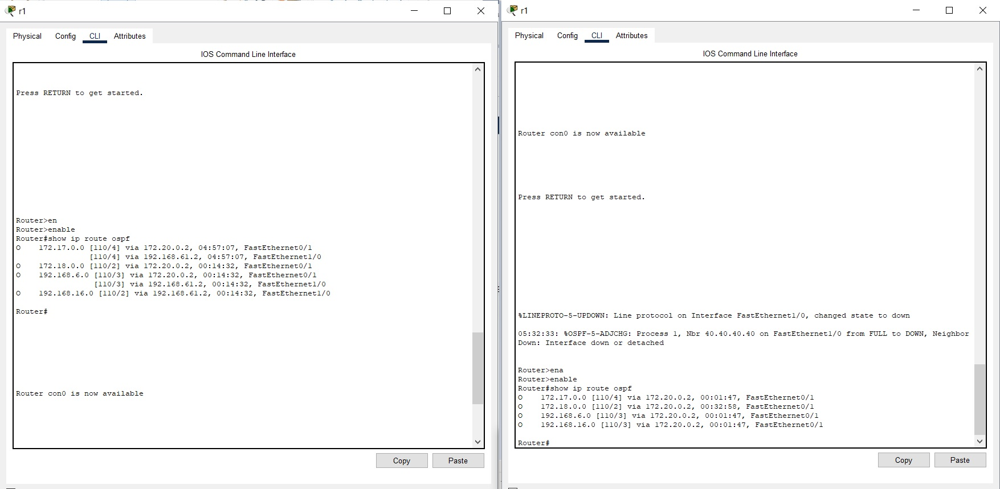

2. Убедиться что трафик от компов до сервера ходит через два маршрута с помощью ЕСМР. 
3. Скинуть скриншот с таблицей маршрутизации с r1. Должны быть сети Connected для VLAN’ов.

4. Поймать трейс на любом компе, когда он пойдет через r5. Удалить один из линков на r5. Снова сделать трейс, убедиться что трафик пошел по резервному пути. Скинуть скриншот с разными трейсами.

5. Скинуть еще один скриншот с изменившейся таблицей маршрутизации с r1. Справа после разрыва линка к r5.
